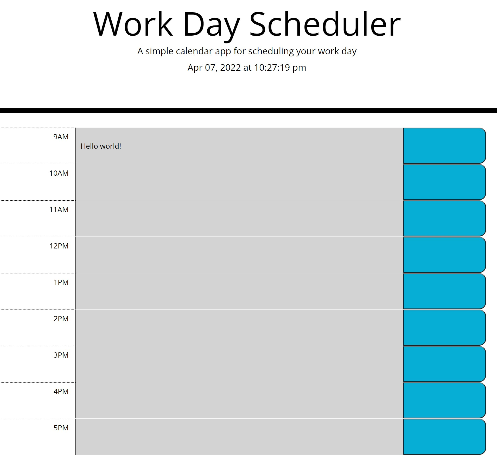

# Work Day Planner

Repository name: day-planner

## Description 

This project is a daily planner that keeps track of your priorities.  You can organize your day by assigning deliverables and tasks to hourly blocks of time throughout the work day.

## Table of Contents (Optional)

* [Installation](#installation)
* [Usage](#usage)
* [Final Product](#finalproduct)

## Installation

No installation is required; simply visit: https://blec333.github.io/day-planner/ to review my deployed site.

## Usage 

To begin using this site after loading:

Simply type within the available space for any given hour.

Click the buttons on the right of any line to save or update that information.

Your information will be saved for reference even after closing the page.

## Final Product

Deployed Application
https://blec333.github.io/day-planner/

Github Repository
https://github.com/Blec333/day-planner/

### Acknowledgements

©Brennan LeClair
